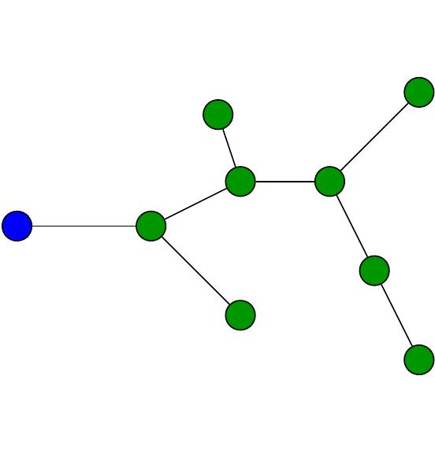

# master-thesis-esp32

Master thesis code presented to the University of Aveiro with the title *Accelerometers array using trilateration spatial localization and network communication*.
This project uses ESP32 microcontrollers and ADXL337 and MPU-6050 accelerometers and programmed in **C/C++**.

## Project at a glance

The embedded workflow combines three core parts:

1. **Acquisition**: ESP32 samples acceleration signals from analog and digital MEMS sensors.
2. **On-node processing**: frequency-domain transforms and peak extraction run on the micro-controller.
3. **Wireless delivery**: nodes exchange scanning/measurement data through a mesh network.

  

## Repository structure

This repository is organized as **independent PlatformIO projects**, each in its own folder with a dedicated `platformio.ini` and `src/main.cpp`.

| Folder | Purpose |
|---|---|
| `Accelerometer - ADXL337` | Reads analog X/Y/Z channels from an ADXL337 and converts readings to acceleration. |
| `Accelerometer - MPU-6050` | Samples acceleration from an MPU-6050 using Adafruit libraries. |
| `Accelerometers - Frequencies peaks` | Synthetic multi-sine signal generation plus FFT peak detection validation. |
| `Experiment 1 - Accelerometer comparison` | Accelerometer acquisition + FFT analysis workflow for comparison experiments. |
| `Experiment 2 - PainlessMesh` | Combines mesh networking and sensor/FFT pipeline in a distributed setup. |
| `Experiment 3 - Accelerometer ADXL337` | ADXL337-focused frequency/monitoring experiment variant. |
| `MPU-6050 - FFT` | MPU-6050 real measurements processed with FFT and logging. |
| `PainlessMesh - Home` | Mesh “home/base” role implementation. |
| `PainlessMesh - Scan` | Mesh scanning/transmission node experiment. |
| `Project Testing Code` | Sandbox/testbed for data acquisition and FFT processing changes. |
| `painlessMesh - FTT` | Mesh + accelerometer + FFT integration prototype. |
| `painlessMesh - frequencies` | Mesh-based transmission of frequency-domain information. |

## Hardware and software baseline

Hardware projects:

- Board: `esp32`
- Framework: Arduino (via PlatformIO)

Used libraries:

- `painlessmesh/painlessMesh`
- `kosme/arduinoFFT`
- `adafruit/Adafruit MPU6050`
- `adafruit/Adafruit Unified Sensor`
- `ArduinoJson`, `TaskScheduler`, `AsyncTCP`, `Ticker`

## Author

João Nuno Valente
